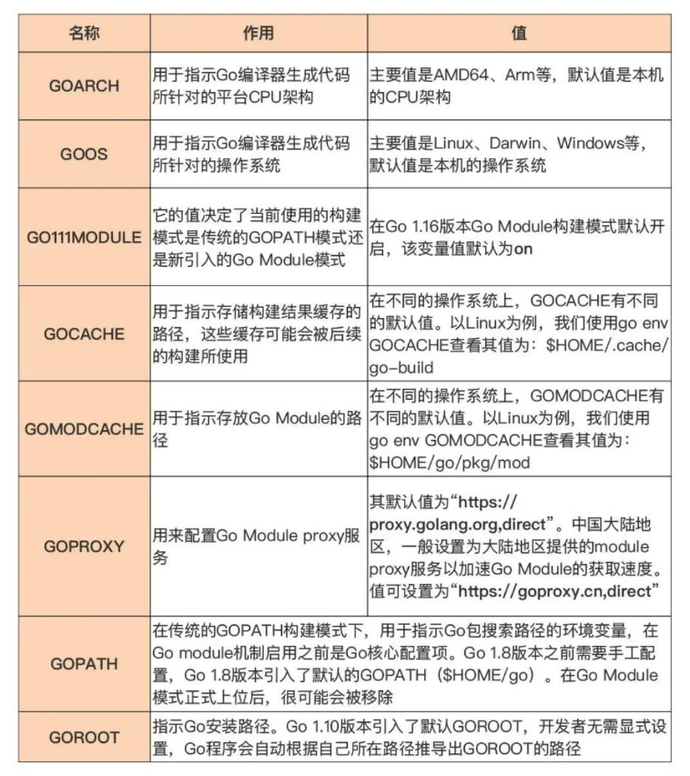

# 安装

## 下载地址

[https://go.dev/dl/](https://go.dev/dl/)

## 安装配置

你可以用源码编译的方式安装。但一般建议用官方提供的安装包安装。

### Window 系统

window 系统的安装很简单，只有下载好安装包，执行安装即可。

### Linux 系统

Linxt 系统的安装分为两步：

1. 下载官方提供的包
2. 把包里可执行文件添加到环境变量中

以安装 1.19.1 版本为例，具体操作示范：

```bash
// 下载安装包
wget https://go.dev/dl/go1.19.1.linux-amd64.tar.gz
// 如果有旧版本，先删除旧版本
rm -rf /usr/local/go
// 解压包到local路径
tar -C /usr/local -xzf go1.19.1.linux-amd64.tar.gz
```

接下来添加环境变量，编辑 `$HOME/.profile` 或 `/etc/profile`文件,加入这句命令：

```bash
export PATH=$PATH:/usr/local/go/bin
```

重新打开终端

## 校验

执行命令，确认是否安装成功

```bash
go version
```

## 环境变量

安装完 Go 之后，它会默认给我们的电脑添加很多环境变量，这些环境变量都是 Go 在工作是时会用到的，通常一般的开发使用默认设置即可。但如果你需求实现一些负责操作，也许需要手动修改。  
执行下列命令可以看到当前 Go 的环境变量

```bash
go env
```

这是一些常用的环境变量说明：
                     
如果你想了解更多其他环境变量的说明，可以执行命令：
```
go help environment
```

