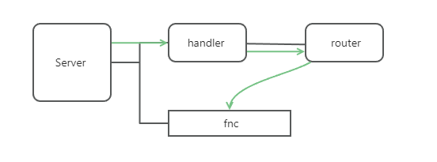

# 微型 WEB 框架

本文我们将尝试基于 `net/http` 库开发一个简单的 WEB 框架，开始之前你需要了解`net/http` 库的基本用法([你可以点击此处跳转](/packages/http.md))。

## 完整代码
本文的完整代码可以在此仓库查看[https://github.com/Bluesgavin/go-web](https://github.com/Bluesgavin/go-web)

## 基础实现

假如我们现在有一个业务常见，需要启动一个 Web 应用，可以实现图书仓库的增删改查接口。假如使用 `net/http` 基础库，代码的轮廓大致如下：

```go
package main

import (
	"fmt"
	"net/http"
)

func home(w http.ResponseWriter, r *http.Request) {
	fmt.Fprintf(w, "HOME PAGE")
}
func addBook(w http.ResponseWriter, r *http.Request) {
	fmt.Fprintf(w, "ADD A BOOK!")
}
func getBook(w http.ResponseWriter, r *http.Request) {
	fmt.Fprintf(w, "GET A BOOK!")
}
func updateBook(w http.ResponseWriter, r *http.Request) {
	fmt.Fprintf(w, "UPDATE A BOOK!")
}
func deleteBook(w http.ResponseWriter, r *http.Request) {
	fmt.Fprintf(w, "DELETE A BOOK!")
}

func main() {
	// 主页
	http.HandleFunc("/", home)
	// 新增图书
	http.HandleFunc("/book/add", addBook)
	// 查找图书
	http.HandleFunc("/book/get", getBook)
	// 删除图书
	http.HandleFunc("/book/delete", deleteBook)
	// 更新图书
	http.HandleFunc("/book/update", updateBook)

	if err := http.ListenAndServe(":8081", nil); err != nil {
		panic(err)
	}
	fmt.Println("server started!")
}
```

## 第一次框架设计
根据上方代码，我们可以初步给我们的框架定义出三个的模块：
- Server：主要负责服务的启动，注册路由
- Handler：负责多种回调函数的封装
- Context：负责封装处理请求内容

#### Context模块
由此我们可以先确定 Context 的内容
```go
type Context struct {
	W http.ResponseWriter
	R *http.Request
}

// 覆盖上方代码中的常用响应
func (c *Context) respond(content string) {
  fmt.Fprintf(c.W, "%s", content)
}

// 用于创建新 Context 实例
func NewContext(W http.ResponseWriter, R *http.Request) *Context {
	return &Context{
		W: W,
		R: R,
	}
}
```

####  Handler模块
目前看来 Handler 并没有功能，但把通过封装自定义类型，可以省略大量回调函数相关的代码。
```go
type HandlerFunc func(c *Context)
```
#### Server模块
```go
type Server struct {
}

// 启动服务
func (s *Server) Start(address string) error {
	return http.ListenAndServe(address, nil)
}

// 注册路由
func (s *Server) Route(pattern string, handlerFn HandlerFunc) {
	http.HandleFunc(pattern, func(writer http.ResponseWriter, request *http.Request) {
		ctx := NewContext(writer, request)
		handlerFn(ctx)
	})
}

// 用于创建新 Server 实例
func NewServer() *Server {
	return &Server{}
}
```

#### 更新代码
有了我们的定义模块之后，我们可以把开头的代码修改为：
```go
func home(c *Context) {
	c.Respond("HOME PAGE")
}
func addBook(c *Context) {
	c.Respond("ADD A BOOK!")
}
func getBook(c *Context) {
	c.Respond("GET A BOOK!")
}
func updateBook(c *Context) {
	c.Respond("UPDATE A BOOK!")
}
func deleteBook(c *Context) {
	c.Respond("DELETE A BOOK!")
}

func main() {
	server := NewServer()
	// 主页
	server.Route("/", home)
	// 新增图书
	server.Route("/book/add", addBook)
	// 查找图书
	server.Route("/book/get", getBook)
	// 删除图书
	server.Route("/book/delete", deleteBook)
	// 更新图书
	server.Route("/book/update", updateBook)

	if err := http.ListenAndServe(":8081", nil); err != nil {
		panic(err)
	}
	fmt.Println("server started!")
}
```
## 二次优化
目前为止，我们只是简单地把代码封装了一下。但我们的框架功能不能仅仅如此，还需要考虑：         
1. 支持POST，PUT，DELETE等其他请求方式。
2. 支持中间件功能
3. 路由优化,采用路由树管理路由
4. 支持通用路由——`*`


#### 中间件效果设计
这里的中间件指的是像 `eggJs` 一样的洋葱模型中间件效果。这里使用闭包设计，把函数层层嵌套实现最终效果。

#### 路由设计
我们加入一个新的 `Router` 模块,主要负责路由的定于与查找。这里我们可以用 “树状” 结构实现。

#### 通用路由
有时候，我们需要配置通用路由，格式为`book/*`。这种路由可以触发 book下的所以子路由函数。要实现这种效果，我们需要在路由的搜索上作节点类型的判断。

#### 整体思路
综上考虑，我们可以得出我们的设计模型：                
                  
框架暴露一个 `Server` 模块，`Server` 下有 `handler` 和 `fnc` 。其中 `fnc` 是通过中间件封装后的执行函数。在图中绿色线为请求的执行路径，`Server` 接收到请求后会交给 `handler` 处理，而 `handler` 下有一个 router 模块，它会判断请求的 `url` 和 `method` ，如果找到对应注册过的函数，就会生成一个新的 `Context` 并带入 `fnc` 中执行。

